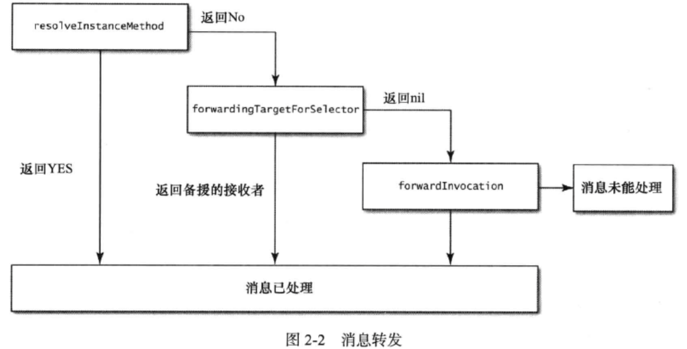

## 关于objective-c
- 该语言使用消息结构(messaging structure)，而非函数调用(function calling)。由smalltalk演化。
区别在于：消息结构采用的是动态绑定，函数调用则是有编译器决定的。
几个概念：动态绑定，虚方法表（virtual table）
- 编译语言和运行期语言。objc许多工作由运行期组件而非编译器完成，要提升性能，只需要更新运行期组件；而编译期做处理的语言，若想获得性能提升，需要重新编译应用。
- objc是c的superset，必须同时掌握C和objective-c，方能写出高效的Objective-C代码。
- Objective-C的对象内存总是分配在heap space，绝不会分配在stack上。
``` objc
NSString stackString;
//error
```
- 掌握C有助于了解内存模型和指针

## 类的头文件少引用其他头文件
- @class forwarding declaring向前声明，只能告诉编译器有某个协议，并不知道完整定义。就是让编译器编译通过。
- 好处：缩短编译时间，还能降低依赖(循环依赖)。
- 除非有必要，不要引入头文件。

## literal
- 字面量(literal)。使得代码更易读
``` objc
NSString *someString = @"Effective Objective-C 2.0";
NSNumber *doubleNumber = @3.14;
NSArray *animals = @[@"cat",@"dog"];
NSString *dog = animals[1]; //[animals objectAtIndex:1]
```
- 用字面量语法创建数组和字典时，若值中有nil，则会抛出异常。

## 类型常量，好过#define预处理
- 预处理缺少类型信息
- 类型常量。命名：若在m文件中，以k开头；若在h文件中，以类名作为前缀。
``` objc
static const NSTimeInterval kAnimationDuration = 0.3;
```
static意味着该变量仅在此变量的编译单元中可见；const意味若修改，编译器会报错。
若不加static，则编译器会创建一个外部符号（external symbol）。
若同时声明为static const，则不会创建符号，而是把所有遇到的变量都替换为常量。
- 全局常量放在“全局符号表”中，以便在定义该常量的编译单元之外使用。**注意const的位置**
``` objc
//header file
extern NSString *const EOCStringConstant;

//implementation file
NSString *const EOCStringConstant = @"value";
```

## 枚举enum
``` objc
enum EOCConnectionState:NSInteger{
  EOCConnectionStateDisconnected,
  EOCConnectionStateConnecting,
  EOCConnectionStateConnected
};
typedef enum EOCConnectionState EOCConnectionState;
```
- 普通枚举和选项枚举option
``` objc
typedef NS_ENUM(NSUInteger,EOCConnectionState){
  EOCConnectionStateDisconnected,
  EOCConnectionStateConnecting,
  EOCConnectionStateConnected
};
typedef NS_OPTIONS(NSUInteger,EOCPermittedDirection){
  EOCPermittedDirectionUp = 1 <<0,
  EOCPermittedDirectionDown =  1<<1,
  EOCPermittedDirectionLeft =  1<<2,
  EOCPermittedDirectionRight  = 1<<3
};
```
- switch语句中使用枚举，最好不要有default分支，这样稍后加了一种状态，那么编译器会发出警告。

## object is building block. 在对象之间传递数据并执行任务的过程叫“消息传递”（messaging）

## property
- 声明一个属性后，编译器自动生成setter，getter方法，还会向类中添加适当类型的实例变量。也可以在类的实现代码中通过@synthesize语法指定实例变量的名字：
``` objc
@implementation EOCPerson
@synthesize firstName = _myFirstName;
@end
```
- 如果你只实现了其中一个存取方法，那么另一个还是会由编译器来合成。
- 还有一种方法能够阻止编译器自动合成，就是使用@dynamic关键字。
- property attribute
atomic
readwrite
readonly
内存管理，数据的所有权
  + assign scalar type的简单赋值操作
  + strong 拥有关系。设置新值时，设置方法会先保留新值，并释放旧值，然后再设置新值。
  + weak 非拥有关系。同assign类似，在属性指向对象销毁后，属性值nil out
  + unsafe_unretained 语义和assign相同，但是适用于对象类型，表达一种非拥有关系。当对象遭到销毁时，属性值不会自动清空。
  + copy 所属关系类似strong，然而设置方法不保留新值，而是将其copy。保护属性的封装性。属性类型是NSString*，新值指向一个NSMutableString类的实例。若不用copy，设置完属性后，字符串的值可能遭人更改。
方法名
  + getter=<name>
  + setter=<name>
- 开发iOS程序时应该使用nonatomic属性，因为atomic属性会严重影响性能。

## 在对象内部尽量直接访问实例变量
- 在对象内部读取数据时，直接通过实例变量来读，写入数据时，通过属性来写
- 在初始化及dealloc方法中，总是通过实例变量来读写数据
- 通过lazy init方法配置的情况下，需要通过属性来读取数据

## equal判断
- ==默认是比较指针，使用NSObject的方法isEqual:来比较值是否相等
- NSString isEqualToString: 比isEqual:方法快，后者要执行额外的步骤。
- isEqual: and hash
``` objc
//一种比较好的计算hash的方法，在碰撞频度和运算复杂程度之间取舍。速度快，hash碰撞几率低的算法。
- (NSUInteger)hash{
  NSUInteger firstNameHash = [_firstName hash];
  NSUInteger lastNameHash = [_lastName hash];
  NSUInteger ageHash = _age;
  return firstNameHash ^ lastNameHash ^ ageHash;
}
```
- 等同性判断的深度。如果对象的所有属性都相等，这叫做“深度等同性判定”
- 容器中可变类的等同性。如果把某对象放入set中之后再修改其内容，那么后面的行为将很难预料。

## class cluster
- 类族模式可以把实现细节隐藏在一套简单的公告接口后面
- 从类族的公共抽象基类中继承子类时要当心，先阅读开发文档
- factory pattern是实现类族的一种方法。
- 直接比较class不适用于类族模式
- 基类定义接口，提供一个实例化的方法；子类重写某些方法，实现不同的功能。
+ (UIButton *)buttonWithType:(UIButtonType)type;

## 使用关联对象存放自定义数据
- 使用关联对象将两个对象联系起来
- 关联对象用到的方法：
 + void objc_setAssociatedObject(id object, void* key,id value,objc_AssociationPolicy)
 + id objc_getAssociatedObject(id object, void* key)
 + void objc_removeAssociatedObjects(id object)

 ``` objc
 #import <objc/runtime.h>

 static void *EOCMyAlertViewKey = "EOCMyAlertViewKey";
 - (void)askUserAQuestion{
   UIAlertView *alert = [[UIAlertView alloc]
          initWithTitle:@"Question"
          message:@"What do you want to do?",
          delegate:self,
          cancelButtonTitle:@"Cancel",
          otherButtonTitles:@"Continue",nil];
    void (^block)(NSInteger) = ^(NSInteger buttonIndex){
      if(buttonIndex==0){
        [self doCancel];
      }else{
        [self doContinue];
      }
    };
    objc_setAssociatedObject(alert,EOCMyAlertViewKey,block,OBJC_ASSOCIATION_COPY);
    [alert show];
 }

 - (void)alertView:(UIAlertView *)alertView
    clickedButtonAtIndex:(NSInteger)buttonIndex{
      void (^block)(NSInteger) = objc_getAssociatedObject(alertView,EOCMyAlertViewKey);
      block(buttonIndex);
    }
 ```
- 还可以通过子类继承父类，添加新属性的方式来做

## objc_msgSend 与消息转发
- 若对象无法响应某个selector，则进入消息转发流程
- 通过运行期的动态方法解析功能，我们可以在需要用到某个方法时将其加入类中
- 对象可以把其无法解读的某些selector转交给其他对象处理
- 经过上述两步后，若还是没有办法处理selector，那就启动完整的消息转发机制。

resolveInstanceMethod ->*No*-->forwardingTargetForSelector-->*nil*-->forwardInvocation-->消息未处理
|           |                                   |
|           |                                   |
消息已处理



``` objc
//利用消息转发机制来实现@dynamic属性
```
