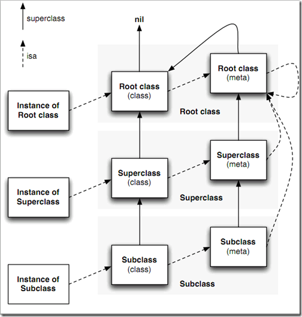

# type encoding

## relationship of class and metaclass

有几点需要注意：
- root class(class)没有父类，因此它的superclass指向nil
- 每一个class的isa都指向唯一一个meta class
- root class(meta)的父类是root class(class),也就是NSObject, Class也是一个对象
- 所有的meta class的isa指针都指向root class(meta)

## autorelease pool implementation

http://gold.xitu.io/entry/5599daa2e4b0c4d3e71b292d
