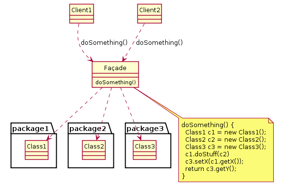

将封装定义为“数据隐藏”，将对象定义为“含有数据和用来访问操作数据的行为的一些东西”。这种观点有很大局限性，只是关注“如何实现对象”。

- 功能分解：常用的分析方法
将问题分解成多个功能步骤，解决小问题比解决整个问题更简单。
功能分解的问题：
  + 主程序负责协调子程序，职责过于复杂。通过委托，让子函数负责自己的行为，并告知主函数执行某些任务。这种方式比功能分解的方法更灵活。
  + 另外就是对可能出现的变化，缺少应变。
```
bug源于代码修改
```

- 需求和应对需求变更
```
需求总在变化
```
方案：模块化封装变化
```
function: display shape
input: type of shape
action:
  switch(type of shape)
    case square: put display function for square here
    case circle: put display function for circle here

```
这种方法依然存在问题：低内聚，紧耦合。
```
内聚性cohesion：类中方法之间联系的紧密程度。方法联系紧密，相关性高，类的职责就清晰，容易理解。反面典型是“上帝对象”，好像是万能的，上帝才能理解。
耦合性coupling：两个类之间联系的紧密程度。
软件开发的目标是低内聚高耦合。类内部完整，职责单一。与其他类之间联系则灵活，松散。
```
抽象类
概念（职责是什么）：其他类的占位符
约束（如何使用）：包含一组代表其他类行为的方法
实现（如何实现）：无法实例化的类，方法可以实现

封装：意味着隐藏，各种隐藏。隐藏数据，隐藏类型等等
多态：不同的对象对于同一个消息有各自不同的行为。
面向对象范型

## UML
创建程序模型的图形语言。UML有几种不同的图，有些用于分析，有些用于设计，还有用于实现。

| phase   |    UML diagram    |
|---------|-------------------|
|分析阶段|用例图，系统与实体的交换；活动图|
|对象的交互| 交互图（顺序图），说明对象之间如何交互。|
|设计阶段| 类图，描述类之间的关系。|
|对象所处状态不同时的差异| 状态图，对象不同的状态以及状态之间的转换|
|配置阶段|部署图|

### 类图
- 类之间的关系
 + 一个类是另一个类时：is-a
 + 一个类包含另一个：has-a，拥有
 + 一个类使用另一个：use-a
 + 一个类创建另一个
 包含关系还分：组合（部分不能独立存在于整体，如汽车中的发动机）和聚集（部分可独立存在于整体，如车库中的汽车）

|square |
|-------|
|-length:double|
|+display() //+表示公开方法，-表示私有|

- 四种表示类关系的UML图
聚集：空心菱形
组合：实心菱形
继承：空心三角形
依赖：带箭头虚线

- 类图中斜体表示抽象类

### 交互图
- 上面一排表示对象和类型，如shape1：Shape
- 每个对象下面的柱形表示对象的生命周期
- 从一个柱形到另一个柱形的箭线表示a向b发送一个消息，消息可以有返回值（另一个箭线）

## 标准的面向对象解决方案

- 按接口编程
- 尽量用聚合代替集成
- 找出变化并封装之

## facade外观模式
- 意图：希望简化原有系统的使用方式。需要定义自己的接口。
- 问题：只需使用某个复杂系统的子集，或者，需要以一种特殊的方式与系统交互。
- 解决方案：facade为原有系统的客户提供一个新的接口。
- 实现：定义一个或多个具备所需接口的新类。新类使用原有系统。

如果facade能够设计成无状态的，那么就能够被多个其他对象使用。
facade模式还可以用来隐藏或者封装系统。封装系统的原因有很多：
  + 跟踪系统使用情况
  + 改换系统

facade模式可以应用于：
- 不需要使用一个复杂系统的所有功能
- 希望封装或者隐藏原系统
- 希望使用原系统的功能，还希望增加一些新的功能
- 编写新类的成本小于所有人使用原系统的成本

|Pattern	|  Intent |
|---------|---------|
|Adapter	|Converts one interface to another so that it matches what the client is expecting|
|Decorator|	Dynamically adds responsibility to the interface by wrapping the original code|
|Facade	  |Provides a simplified interface|

facade and adapter区别：facade模式简化了接口，adapter模式则将一个已有的接口转换成另一个接口。



## Adapter
我们需要一种方式，为一个功能正确但接口不合的对象创建一个新接口。
- 关键特征
- 描述多态
- Adapter与Facade比较

- adapter模式最常见的用途就是保持多态性。使得原本由于接口不兼容而不能一起工作的类可以一起工作。
- 意图：使控制范围之外的一个原有对象与某个接口匹配
- 问题：系统的数据和行为都正确，但接口不符。通常用于必须从抽象类派生时。
- 解决方案：adapter模式提供了具有所需接口的包装类。
- 实现：将原有类包含在另一个类中，让包含类与需要的接口匹配，调用被包含类的方法。

## 概念
敏捷实践关注：无冗余，可读，可测试

## strategy pattern
灾难往往是短期未臻最优的决策，长期累积而引起的
导致两种结果：
- 过度分析，或者分析瘫痪
- 过度细节化，或者放任自流
所以设计的时候要考虑变化，并尝试预测其出现的位置。在《设计模式》一书中描述此方式所基于的原则：
- 针对接口进行编程，而不要针对实现编程
- 优先使用对象组合，而不是类继承
- 考虑设计中什么应该是可变的。着眼点在于什么能够在不重新设计的前提下改变。这是主要关注的就是对变化的概念进行封装。

解耦：将各个行为进行分离
strategy
- 意图：根据所处上下文，使用不同的业务规则或算法
- 问题：对算法的选择取决于客户的请求和要处理的数据。如果只有一些不变的算法，无需strategy模式
- 解决方案：将对算法的选择和算法的实现想分离
- 参与者与协作者：
  + strategy指定了如何使用不同的算法（规约）
  + concreteStrategy实现了不同的算法
  + context通过引用strategy，使用具体的concreteStrategy
- 效果：
  + strategy模式定义了一系列的算法
  + 可以不使用swtich语句或条件语句
  + 必须以相同的方式调用所有的算法

## bridge pattern
一组变化使用另一组变化
- 意图：将一组实现与使用他们的对象分离
- 问题：一个抽象类的派生类必须使用多个实现，但不能出现类数量的爆炸性增长。
- 解决方案：为所有实现定义个接口，供抽象类的所有派生类使用。
- 参与者与协作者：
- 效果：实现与使用实现的对象解耦，提供了可扩展性，客户对象无需操心实现问题
- 实现：将实现封装在一个抽象类中；抽象类的基类中包含一个实现的句柄。
